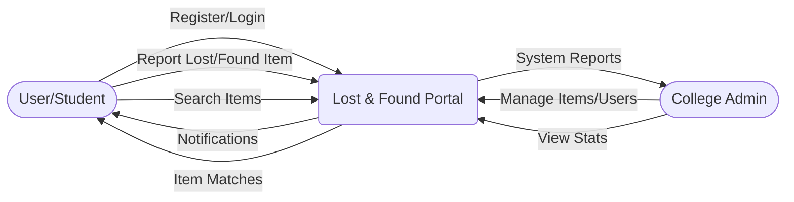
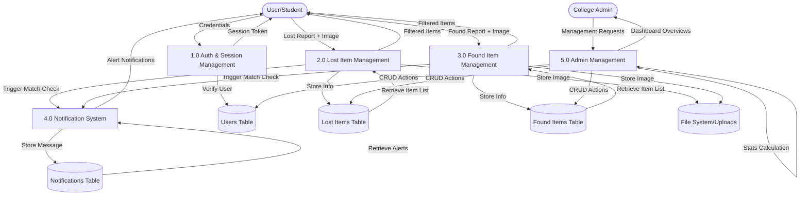

# Data Flow Diagram (DFD) - Lost and Found Portal

## Level 0: Context Diagram
The Level 0 context diagram shows the system as a whole and its interactions with external entities.

---

## Level 1: System Data Flow Diagram
The Level 1 DFD breaks down the system into its primary functional processes and displays data stores.

### Key Data Flows Explained:
1.  **Item Match Processing**: When a lost item is reported (P2), the system checks existing found items (D3). If a match is found, a record is added to the Notifications Table (D4).
2.  **Image Uploads**: Any item reports including images flow into the file system (D5), with corresponding URL paths stored in D2 or D3.
3.  **Unified Search**: Both P2 and P3 read from their respective data stores to provide users with searchable lists of current items.
4.  **Admin Oversight**: Admin processes (P5) have full read/write access to all database tables (D1-D4) for moderation and management.
