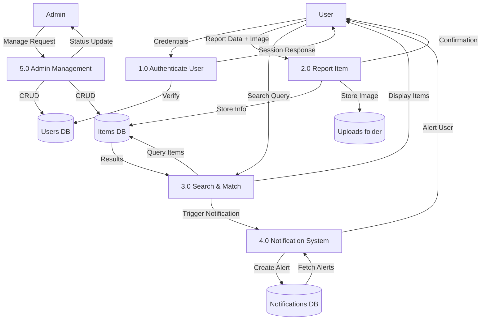
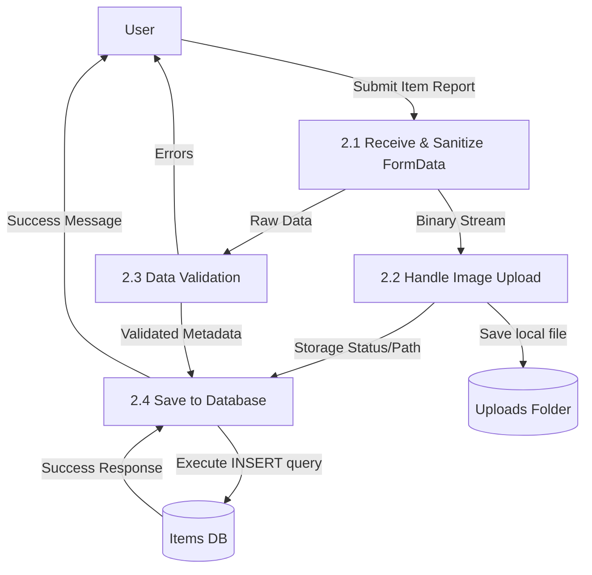
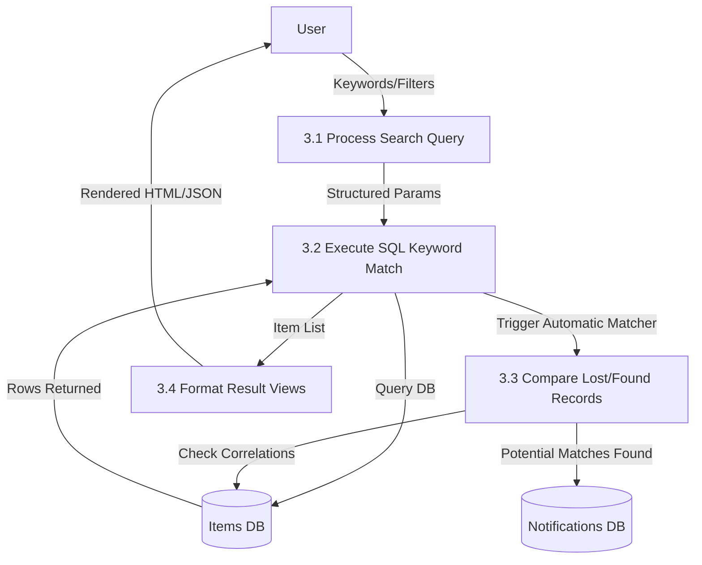

# Mermaid Data Flow Diagrams (Level 1 & 2)

## Level 1 DFD: System Functional Decomposition
This level breaks the "Lost & Found Portal" into main functional processes.

---

## Level 2 DFD: Detailed "Report Item" Process (2.0)
This level expands the **2.0 Report Item** process from Level 1.

---

## Level 2 DFD: Detailed "Search & Match" Process (3.0)
This level expands the **3.0 Search & Match** process from Level 1.

